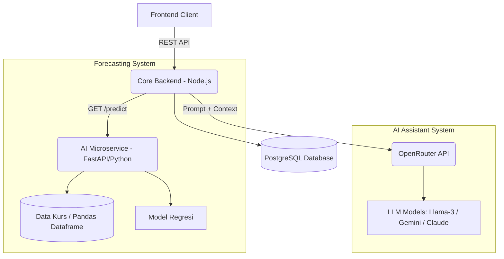

# Machine Learning Architecture & Pipeline Document: MONI

## 1. Pendahuluan
Dokumen ini mendefinisikan arsitektur, *pipeline*, dan infrastruktur untuk layanan *Artificial Intelligence* (AI) pada aplikasi MONI. Berdasarkan kebutuhan produk, terdapat dua fitur utama AI yang akan dikembangkan:
1. **Exchange Rate Forecasting (Regresi Deret Waktu):** Memprediksi tren nilai tukar mata uang jangka pendek untuk penyesuaian otomatis target *sinking fund*.
2. **AI Financial Assistant (Chatbot & Smart Recommendations):** Asisten cerdas berbasis *Large Language Model* (LLM) yang menggunakan integrasi OpenRouter API untuk memberikan analisis pengeluaran, peringatan proaktif (*smart alert*), dan interaksi *chat* mengenai rekomendasi pemangkasan anggaran.

---

## 2. Arsitektur Sistem AI
Untuk menyeimbangkan beban *server* dan kompleksitas pengembangan, arsitektur AI dibagi menjadi dua pendekatan:
1. **Microservice AI (Python):** Khusus menangani algoritma regresi dan kalkulasi matematika berat (*Forecasting*).
2. **Core Backend (Node.js):** Bertugas menangani *prompt engineering* dan koneksi HTTP ringan ke layanan LLM (OpenRouter).

---

## 3. Pipeline 1: Exchange Rate Forecasting (Regresi)

### 3.1. Pengumpulan Data (*Data Ingestion*)
*   **Sumber Data:** API Finansial Publik (misal: Alpha Vantage, ExchangeRate-API, atau Yahoo Finance).
*   **Mekanisme:** *Cron job* pada Backend Node.js akan menarik data kurs *close price* harian pada waktu tertentu (misal: pukul 23:59) dan menyimpannya di tabel database `EXCHANGE_RATE`.

### 3.2. Pra-pemrosesan Data (*Data Preprocessing*)
*   **Handling Missing Values:** Mengisi data kurs yang kosong pada hari libur bursa pasar saham (Sabtu-Minggu) menggunakan teknik *Forward Fill* (menggunakan harga hari Jumat).
*   **Windowing/Lagging:** Mengubah format data deret waktu (*time-series*) menjadi format *supervised learning*. Contoh: Menggunakan pergerakan kurs 7 hari terakhir (X) untuk memprediksi harga hari ke-8 (Y).

### 3.3. Pemodelan (*Modeling*)
*   **Pendekatan:**
    *   *Baseline:* **Regresi Linier Sederhana** atau **Moving Average** (Cocok untuk versi MVP awal).
    *   *Intermediate (Disarankan):* **Prophet** (dari Meta) atau **ARIMA**, karena sangat andal dalam mendeteksi tren dan musiman pada data finansial.
*   **Siklus Pelatihan (*Retraining*):** Model akan dilatih ulang secara otomatis setiap minggu (*weekly batch job*) agar selalu beradaptasi dengan kondisi volatilitas makroekonomi terbaru.

### 3.4. Evaluasi Model
*   **Metrik Evaluasi:** *Mean Absolute Percentage Error* (MAPE) dan *Root Mean Squared Error* (RMSE).
*   **Target Kelayakan:** Prediksi untuk rentang 3–7 hari ke depan diharapkan memiliki margin *error* (MAPE) di bawah 2% untuk dianggap layak pakai dalam kalkulasi target tabungan.

---

## 4. Pipeline 2: AI Financial Assistant (via OpenRouter API)

Alih-alih melatih model bahasa sendiri, sistem ini memanfaatkan **OpenRouter API** sebagai *gateway* ke model LLM *open-source* atau komersial terbaik yang *cost-effective*.

### 4.1. Pemilihan Model LLM
*   **Rekomendasi Model di OpenRouter:** `meta-llama/llama-3-8b-instruct` (cepat dan murah untuk *smart alert*) atau `google/gemini-flash` (konteks panjang dan *reasoning* bagus).

### 4.2. Context Injection (RAG Ringan)
Agar *chatbot* tidak halusinasi dan dapat memberikan analisis yang relevan, Backend Node.js akan menyisipkan konteks finansial pengguna ke dalam *System Prompt* sebelum mengirimkannya ke OpenRouter.
*   **Konteks yang disisipkan (diambil dari Database):**
    1.  Status *goal* pengguna (sisa hari, target akhir, persentase ketercapaian).
    2.  Proyeksi defisit berdasarkan model regresi di Pipeline 1.
    3.  Data transaksi 30 hari terakhir (terklasifikasi antara "Esensial" vs "Non-Esensial").

### 4.3. Implementasi Prompt
*   **Contoh System Prompt untuk Smart Alert / Rekomendasi:**
    > "Anda adalah MONI, asisten pengelola *sinking fund* yang interaktif. User saat ini memiliki target Rp 20.000.000 untuk studi ke Australia dalam 40 hari. Akibat kenaikan kurs AUD, sistem memprediksi user akan kekurangan Rp 500.000 di akhir periode. 
    > 
    > Berikut adalah data pengeluaran 'Non-Esensial' user bulan ini: 
    > - Ngopi: Rp 350.000
    > - Langganan Film: Rp 150.000
    > - Belanja Pakaian: Rp 400.000
    >
    > Tugas Anda: Analisis pengeluaran tersebut dan berikan 2 poin rekomendasi pemangkasan yang masuk akal namun tegas, agar user dapat menutupi defisit Rp 500.000 tersebut."

### 4.4. Alur Kerja (Workflow)
1. **Trigger Otomatis:** Ketika AI Forecasting mendeteksi tren kurs memburuk yang menyebabkan target harian tak tercapai, Backend Node.js menyusun *prompt* dan menembak API OpenRouter. Output dari LLM disimpan sebagai notifikasi (`ALERT`) ke pengguna.
2. **Interaktif (Chatbot):** Saat pengguna membuka *dashboard* dan melakukan *chat*, *prompt history* digabung dengan *financial context* dan dikirim ke OpenRouter, sehingga chatbot dapat menjawab pertanyaan spesifik seperti *"Apa saya masih boleh makan di restoran minggu ini?"*

---

## 5. Deployment & Skalabilitas
*   **Python Microservice (AI Forecasting):** Di-deploy terpisah sebagai Docker container di layanan *Platform as a Service* (seperti Render atau Railway). Hal ini memastikan instalasi *library* berat seperti `pandas`, `scikit-learn`, atau `prophet` tidak membebani ukuran *build* server utama Node.js.
*   **OpenRouter Integration:** Kode untuk memanggil chatbot dapat diletakkan langsung di dalam aplikasi **Core Backend Node.js**. Ini karena LLM di-hosting sepenuhnya oleh pihak ketiga (OpenRouter), sehingga backend hanya melakukan pemanggilan HTTP (`axios`/`fetch`) yang sangat ringan dan tidak memakan RAM memori komputasi tinggi.
